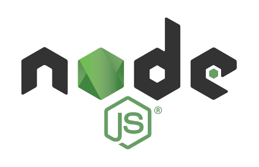

# Node.js Course

> This course teaches you how to write server-side applications with JavaScript using Node.js.

## Prerequisites
- Basic understanding of JavaScript
	- https://github.com/LearnToCodeSeoul/basic_programming_examples/tree/master/javascript
	- https://www.freecodecamp.com/challenges/comment-your-javascript-code

## Syllabus
- [Lesson 1: Intro](/lesson1/)
- [Lesson 2: Basics](/lesson2/)
- [Lesson 3: File I/O](/lesson3/)
- [Lesson 4: Events](/lesson4/)
- [Lesson 5: Streams](/lesson5/)
- [Lesson 6: HTTP](/lesson6/)
- [Lesson 7: Modules](/lesson7/)

## Slack

You can ask any questions about this course on Slack.

http://learnteachcode.slack.com (channel: javascript-kr)

## Schedule
- [1st Meetup on Jan 14](https://www.meetup.com/Learn-Teach-Code-Seoul/events/236563042/)
- [2nd Meetup on Jan 21](https://www.meetup.com/Learn-Teach-Code-Seoul/events/236918324/)
- [3rd Meetup on Feb 4](https://www.meetup.com/Learn-Teach-Code-Seoul/events/237089471/)
- [4th Meetup on Feb 11](https://www.meetup.com/Learn-Teach-Code-Seoul/events/237283260/)
- [5th Meetup on Feb 18](https://www.meetup.com/Learn-Teach-Code-Seoul/events/237542927/)
- [6th Meetup on Feb 25](https://www.meetup.com/Learn-Teach-Code-Seoul/events/237777463/)
- [7th Meetup on Mar 11](https://www.meetup.com/Learn-Teach-Code-Seoul/events/238081011/)
- [8th Meetup on Mar 25](https://www.meetup.com/Learn-Teach-Code-Seoul/events/238428868/)
