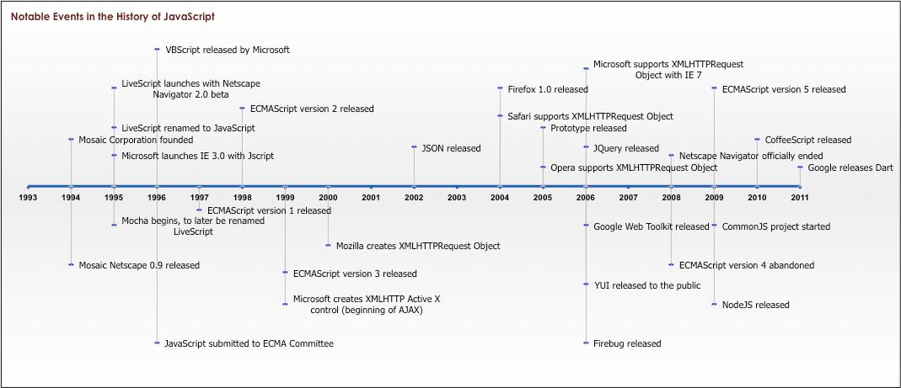
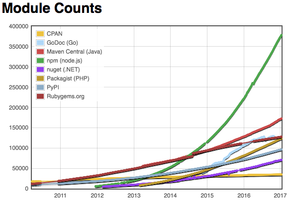

# Lesson 1: Intro

> Who knew JavaScript would end up being a compelling language for wrting serer-side applications?


## JavaScript History



- "Toy" language in 90's
- Ajax revolution in 2005
	- GMail
	- Google Map 
- jQuery released in 2006
- Google Chrome release in 2008
	- JavaScript performance has improved at an incredibly fast rate
	- Heavy competition between browser vendors
- Node.js debuted in 2009
	- Changed the types of applications you can build on the web


## What is Node.js?

Node.js® is a JavaScript runtime built on Chrome's V8 JavaScript engine. 
Node.js uses an event-driven, non-blocking I/O model that makes it lightweight and efficient. 
Node.js' package ecosystem, npm, is the largest ecosystem of open source libraries in the world.
- JavaScript environment for server-side(back-end) development
- Brings JavaScript to the server in much the same way a browser brings JavaScript the client.
- Allows you to build scalable network applications using JavaScript
- Very fast because it's mostly C code
- Uses V8 Engine, the virtual machine that powers Google Chrome
- Uses an **event-driven**, **non-blocking** I/O model
- Node.js = Runtime Environment + JavaScript Library
- Website
	- English : https://nodejs.org/en/
	- Korean : https://nodejs.org/ko/


## What is Node.js NOT?

- A Web Framework
	- Node.js is a platform for JavaScript applications, and it's not to be confused with a framework.
	- It's a common misconception to think of Node.js as Rails or Django for JavaScript, whereas it's much lower level.
	- We'll talk about a popular frameowork for Node.js called Express.js later.

- Multi-threaded
	- You can think of it as a single threaded server.
	- But it can handle concurrent operations without multiple threads of execution, so it can scale pretty well.


## Built on JavaScript

- Used to run only on browsers
- Cross Platform(O/S)
- Limitation


## How fast Node.js growing?

Node.js packages are growing faster than Ruby, Pathon and even Java!



- http://www.modulecounts.com
- http://langpop.corger.nl


## How popular is JavaScript?


Ahead of its annual conference in September 2016, Github shared its report [here](https://octoverse.github.com).


## What's making Node.js so attractive?

- Develepers can write web applications in one language
- Reduce the context switch between client and server development
- JavaScript is unavoidable if you've done any programming for the web
- Full-stack development trend and Start-up booms
- Most coding schools/bootcamps teach JavaScript as the first language
- Node.js is a part of the MEAN stack.
- JSON is a very popular data interchange format today and is native to JavaScript
- JavaScript is the language used in various No SQL (MongoDB, CouchDB)


## What could you build?

Node.js is ideal for I/O bound applications, but not so great for CPU-heavy applications.

- Data Intensive Real-time Applications (DIRT)
- Single Page Applications
- JSON APIs (RESTful Web Services)
- Data Streaming Applications (Music, Video)
- Websocket Server (like a chat server)


## How to install Node.js

Download one-click installers for Mac or Windows [here](https://nodejs.org/en/download)

If you know how to use HomeBrew...

```
$ brew install node
$ brew install npm
```

Make sure it's installed properly on the terminal

```
$ node -v
v7.0.0
$ npm -v
3.10.8
```


## Node.js Console

Node.js provides CLI(Command Line Interface).
Using this shell program, we can execute pretty much any Node.js/JavaScript code on the terminal.

```js
$ node
> 1 + 2
3
> 17 + 31 / 2 * 5
94.5
> 'Hello, ' + 'Node.js!'
'Hello, Node.js!'
> console.log('Hello, World!')
'Hello, World!'
> a = 1; b = 2; a + b
3
> function sqrt(n) { return n * n; }
undefined
> sqrt(3)
9
> new Date();
2017-01-03T03:43:16.185Z
> window.alert('abc');
ReferenceError: window is not defined
```

Be careful! Unlike in a browser, the `window` and `document` global object is absent in Node.js. (Obviously we don't deal with a browser window server-side)


## Launching Node.js Scripts

To start a Node.js script from a file, simply run `node <filename>`.

- Write [hello.js](hello.js).

```js
console.log('Hello, World!');
```

- Just run it!

```js
$ node hello.js
Hello, World!
```


## Node.js IDEs and Code Editors

You don't need to compile JavaScript code, because it's loaded into memory and interpreted immediately.
Therefore, a lightweight text editor is highly recommended.
However, if you are already familiar and comfortable with the IDE of your choice, feel free to stick with it.

- [Sublime Text](https://www.sublimetext.com/3)
- [Atom](https://atom.io)
- [WebStorm](https://www.jetbrains.com/webstorm/)


## JavaScript Basics and Syntax

Don't worry! Most of the Node.js syntax is similar to front-end JavaScript.


### Loose Typing

Automatic typecasting works well most of the time. It's a great feature that saves a lot of time and mental energy!
There are only a few types of primitives.

- String
- Number (both integer and real)
- Boolean
- RegExp
- Undefined
- Null

Everything else is an object.

```js
> 'a' === new String('a')
false
> 'a' === new String('a').toString()
true
> 'a' == new String('a')
true
```

By the way, `==` performs automatic typecasting whereas `===` does not.

```js
> typeof('a')
'string'
> typeof(new String('a'))
'object'
```


### Strings

String are just objects and nothing special about it.

```js
> var text = 'Learn Teach Code Seoul'
undefined
> text.length
22
> text.substr(10)
'h Code Seoul'
> text.substr(10, 5)
'h Cod'
> text.split(' ')
[ 'Learn', 'Teach', 'Code', 'Seoul' ]

```


### Objects

Object notation is super readable and compact.

```js
var car = {
	color: 'white',
	type: 'sedan',
	owner: {
		...
	}
}
```


### Functions

Functions are objects in Node.js and we treat them as variables.


### Define/Create a Function

```js
// Named Function
function hello(name) {
	console.log('Hello,', name, '!');
	return true;
}

// Anonymous Function
var hello = function(name) {
	console.log('Hello,', name, '!');
	return true;
};

// ES6 Arrow Function (a.k.a. lambda)
var hello = (name) => {
	console.log('Hello,', name, '!');
	return true;
};
```


### Pass Functions as Parameters

JavaScript treats functions like any other objects, so we can pass them to other functions as parameters. (usually, callbcks in Node.js)

```js
var convertNum = function(num) {
	return num + 10;
};

var processNum = function(num, fn) {
	return fn(num);
};

processNum(5, convertNum); // 15
```


### Arrays

Arrays are also objects that have some special methods to manage elements in it.

```js
var emptyArr = [];
var numberArr = [1, 2, 3, 4, 5];
var stringArr = ['A', 'B', 'C'];
var arr = [1, 'A', {name: 'Dale'}, function() { console.log('boo'); }];
```

Example

```js
var fruits = ['Apple', 'Banana', 'Coconut'];

console.log(fruits.length);

var fruit1 = fruits[0];
var fruit2 = fruits[1];
var fruit3 = fruits[2];
var fruit3 = fruits[3]; // undefined

fruits[1] = "Lemon" // ["Apple", "Lemon", "Coconut"]

fruits.push("Orange"); // ["Apple", "Banana", "Coconut", "Orange"]
fruits.push("Strawberry"); // ["Apple", "Banana", "Coconut", "Orange", "Strawberry"]

delete fruits[3]; // ["Apple", "Lemon", "Coconut", , "Strawberry"]
```


### If Statement

Conditional statements are used to alter the control flow of a program, based on a specified boolean condition.
A conditional statement looks like this.

```js
if (n > 1) {
 console.log('the variable n is greater than 1.');
} else {
 console.log('the variable n is less than or equal to 1.');
}
```

Inside parentheses you must enter a logic statement, meaning that the result of the statement is either true or false.
The else block is optional and contains the code that will be executed if the statement is false. 


### For Loop

For loops allow you to repeatedly run a block of code a certain number of times. 
This for loop logs to the console ten times:

```js
for (var i = 0; i < 10; i++) {
	console.log(i);
}
```

The first part, `var i = 0`, is run once at the beginning of the loop.
The variable `i` is used to track how many times the loop has run.

The second part, `i < 10`, is checked at the beginning of every loop iteration before running the code inside the loop. If the statement is true, the code inside the loop is executed.
If it is false, then the loop is complete. 

The statement `i < 10` indicates that the loop will continue as long as i is less than 10.

The final part, `i++`, is executed at the end of every loop.
This increases the variable `i` by 1 after each loop. 
Once `i` reaches 10, the loop will exit.


### Want more?

For the complete list of methods and examples, visit the following sites.

https://developer.mozilla.org/en-US/docs/Web/JavaScript/Reference/Global_Objects


## Summary

Node.js is
- Built on JavaScript
- Evented and asynchronous
- Desigend for data-intensive real-time applications
- JavaScript is growing rapidly and *one of the most popular programming languages* :grin:


## Challenges
- [Revising Strings](challenges/revising-strings.js)
- [Rounding Numbers](challenges/rounding-numbers.js)
- [If Statement](challenges/if-statement.js)
- [Array Filtering](challenges/array-filtering.js)
- [Looping Through Arrays](challenges/looping-through-arrays.js)
- [Function Arguments](challenges/function-arguments.js)
