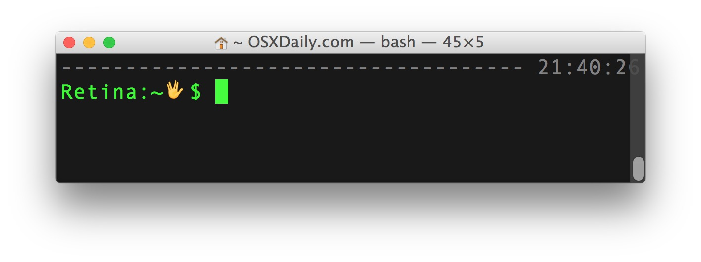

# Lesson 2: Basics

> Let's look at Node.js fundamentals and develop simple applications.


## How Node.js is Different from JavaScript?

Let's take a look at the main difference between Node.js and JavaScript.

Node'js and browser JavaScript differ when it comes to globals.


### Node.js Global Objects

These objects are available in all modules.
As a global, they are always available to Node.js applications without using `require()`.

- console
- __filename
- __dirname

```js
console.log(__filename);
console.log(__dirname);
```


### Node.js Process Information

Each Node.js script that runs is, in essence, a process. Conveniently, developers can access useful information in code with the `process` object.

```js
> process.pid
50169
> process.cwd()
'/Users/1002139/ltcs/nodejs-course'
```

`ps |grep node` outputs all Ndoe.js programs running on your machine.

```bash
$ ps |grep node
50169 ttys000    0:00.12 node
50581 ttys001    0:00.00 grep node
```


#### process.argv

The `process.argv` property returns an array containing the command line arguments passed when the Node.js process was launched.

- The 1st element: the absolute pathname of the executable that started the Node.js process
- The 2nd element: the path to the JavaScript file being executed
- The remaining elements: any additional command line arguments

Write process-args.js

```js
// print process.argv
process.argv.forEach((val, index) => {
  console.log(`${index}: ${val}`);
});
```

Test

```bash
$ node process-args.js one two=three four
0: /usr/local/bin/node
1: /Users/mjr/work/node/process-2.js
2: one
3: two=three
4: four
```


### Exporting and Importing Modules

There is no way to include modules using JavaScript itself in browsers. 
Scripts are supposed to be linked together using a different language(HTML).

We can export and import modules in Node.js with great dependency management.
We'll cover this in a different lesson in more detail.


## Command Line Application



Write a command line application which prints a greeting message on the console.

[greeting.js](greeting.js)

```js
function getFullName(first, last, country) {
  var eastCountries = ['KR', 'CH', 'JP'];
  var westContrries = ['US', 'CA', 'UK'];
  country = country.toUpperCase();

  if (eastCountries.indexOf(country) > -1) {
    return last + ' ' + first;
  } else if (westContrries.indexOf(country) > -1) {
    return first + ' ' + last;
  } else {
    throw new Error('Invalid country!');
  }
}

var first = process.argv[2];
var last = process.argv[3];
var country = process.argv[4];

console.log('Hello, ' + getFullName(first, last, country) + '!');
```

Test

```js
$ node greeting.js Dale Seo KR
Hello, Seo Dale!
$ node greeting.js Dale Seo US
Hello, Dale Seo!
```


## Server Application

> Don't worry if the details in this lesson seem over your head.

> I'd like to give you a preview of what you'll be able to do when you've completed the course.


### What is HTTP Server?


HTTP server listens or waits for requests from clients and returns responses.


### Develop Our First HTTP Server

Our first server always respons with "Hello World".

#### 1. Import Required Module
Use the `require` directive to load the `http` module and store the returned HTTP instance into an http variable.
```js
var http = require('http');
```

#### 2. Create Server

Use the created http instance and call `http.createServer()` method to create a server instance.
It accepts a single argument, a callback function, that will be called on each HTTP request received by the server.
This callback function recevies, as arguments, the request and response objects, which are commonly shortened to `req` and `res`.

```js
var server = http.createServer(function(req, res) {
   res.end('Hello, World!'); // End the response with the message, "Hello, World!"
});
```

For every HTTP request received by the server, the callback funtion will be invoked with new `req` and `res` objects.


#### 3. Listen to client for incoming requests

Bind the server instance at port 3000 using the `listen` method associated with the server instance. 

```js
server.listen(3000);
```


#### 4. Test Our First HTTP Server

Execute the [helloServer.js](helloServer.js) to start our first HTTP server.

```bash
$ node helloServer.js
Server running at http://localhost:3000
```

Open `http://localhost:3000` in any browser and observe the result.
You should receive a plain-text page consisting of the words "Hellow, World!".

Or use the `curl` command on the terminal
```bash
$ curl http://localhost:3000
Hello, World!
```

Now, we have our first HTTP server up and running which is responding to all the HTTP requests at port 3000.


## Challenges

- [Calculator](challenges/calculator.js)
- [Counter Server](challenges/counterServer.js)
